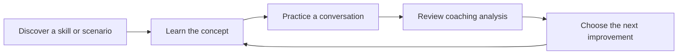
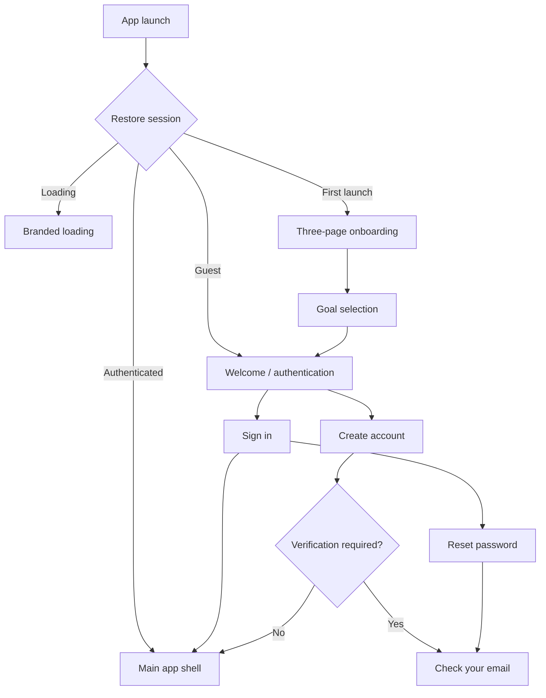
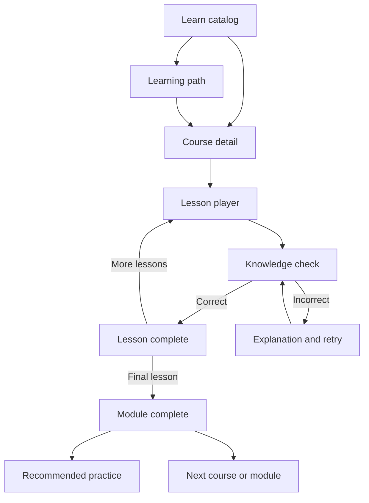
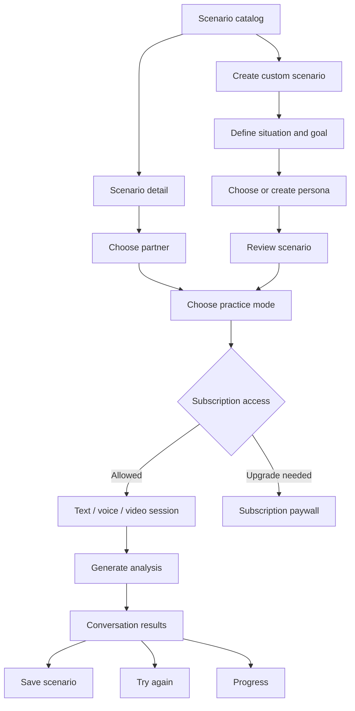
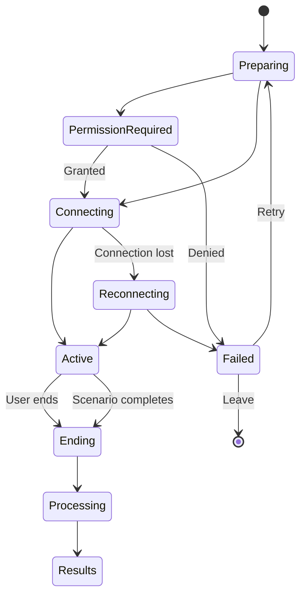
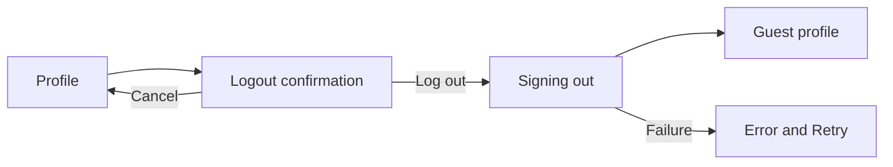
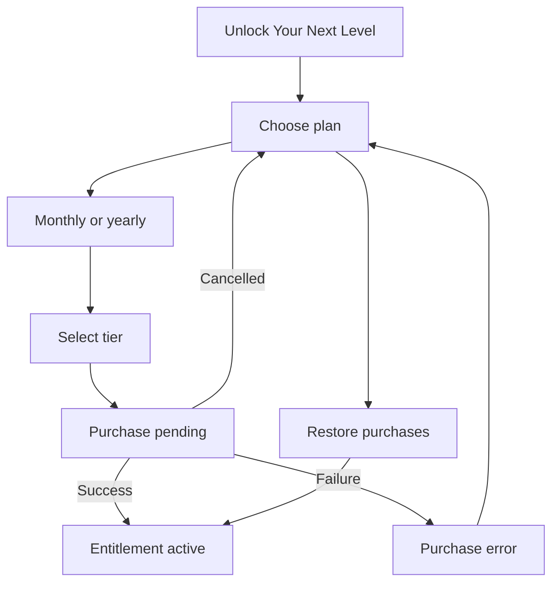

# HardSync Product Flow, Navigation, and State Specification

Version: 1.0  
Updated: 2026-09-25  
Platforms: iOS, Android, responsive Flutter web

## 1. Purpose

This document defines how users move through HardSync, what each screen must
contain, which states each feature supports, and how frontend state relates to
backend state. It is the shared reference for product design, Flutter
implementation, QA, analytics, and backend integration.

The core product loop is:

## 2. Navigation model

### 2.1 App levels

HardSync has three navigation levels.

1. **Entry flows**
   - Onboarding
   - Authentication
   - Password recovery
   - Subscription introduction

2. **Main application shell**
   - Home
   - Learn
   - Practice
   - Progress
   - Profile

3. **Focused flows**
   - Course and lesson player
   - Scenario preparation
   - Custom scenario builder
   - Live text, voice, or video practice
   - Conversation analysis
   - Account deletion

The main navigation remains visible only inside the five main destinations.
Focused flows use their own back, close, or completion actions.

### 2.2 Main navigation

| Position | Destination | Purpose | Default return state |
| --- | --- | --- | --- |
| 1 | Home | Daily overview and next recommended action | Current scroll position |
| 2 | Learn | Paths, courses, modules, and lessons | Last selected path/filter |
| 3 | Practice | Scenario catalog and custom practice | Last selected category |
| 4 | Progress | Learning and practice outcomes | Last selected progress tab |
| 5 | Profile | Identity, account, subscription, and settings | Account overview |

Navigation uses Apple-style Cupertino icons with visible labels. Practice may
use a raised lilac active treatment. The Profile destination always remains
visible and is never replaced by Sign in or Sign out.

### 2.3 Navigation behavior

- Selecting the active tab keeps its current state.
- Switching tabs preserves scroll position and selected filters.
- Back inside a focused flow returns to the previous meaningful product state.
- Closing an entry modal returns to the screen that opened it.
- Completing a lesson returns to the course with updated progress.
- Completing practice opens analysis after processing finishes.
- Completing or dismissing analysis returns to Practice, Progress, or Home
  based on the entry point.
- Authentication and subscription callbacks must restore the intended
  destination rather than always returning to Home.

## 3. User state model

### 3.1 Session states

| State | Description | Allowed experience |
| --- | --- | --- |
| Unknown | Authentication is being restored | Branded loading state |
| Guest | No authenticated account | Browse selected content and open sign-in flow |
| Authenticated free | Valid account without paid entitlement | Free lessons and text practices |
| Authenticated paid | Valid account with active entitlement | Features allowed by active tier |
| Offline cached | Previously authenticated, network unavailable | Cached learning and read-only progress |
| Suspended/error | Account or session cannot be used | Clear recovery action and support route |

### 3.2 Content access states

Every course, lesson, scenario, and feature can be:

- Available
- In progress
- Completed
- Locked by sequence
- Locked by subscription
- Downloaded or cached
- Temporarily unavailable

Sequence locks and subscription locks must look different. Sequence locks show
the prerequisite. Subscription locks show the required plan.

### 3.3 Standard asynchronous states

Every backend-driven surface must support:

- Initial loading
- Refreshing with existing content retained
- Success with data
- Success with no data
- Recoverable error with Retry
- Authentication expired
- Permission denied
- Offline cached data

A loading state must not use fictional user data as a placeholder.

## 4. End-to-end entry flow

### 4.1 Onboarding

Pages:

1. Have Better Conversations
2. Learn Your Way
3. Grow With Confidence

States:

- Page 1, 2, or 3 selected
- Skip available
- Next available
- Get Started on final page
- Goal selection incomplete or complete
- Onboarding already completed

Persistence:

- Save onboarding completion locally and to the authenticated profile when
  possible.
- Do not show onboarding on every launch after completion.

### 4.2 Authentication

Routes:

- Welcome
- Create account
- Sign in
- Reset password
- Check email

Form states:

- Empty
- Focused field
- Invalid field
- Valid form
- Submitting
- Provider redirect
- Invalid credentials
- Existing account
- Network failure
- Successful authentication

Successful authentication returns to the original requested destination.

## 5. Home flow

### 5.1 Purpose

Home answers three questions:

1. Where am I in my development?
2. What should I continue?
3. What is the best next action today?

### 5.2 Content order

1. Personalized greeting and notification entry
2. Overall progress hero
3. Streak, completed lessons, and practice time
4. Continue learning
5. Recommended practice
6. Encouragement or milestone card

### 5.3 States

| State | Home behavior |
| --- | --- |
| First day | Welcome message, choose a path, recommended first practice |
| Active learner | Current path, resume lesson, recommended practice |
| Path completed | Completion celebration and choose next path |
| New achievement | Achievement callout with View action |
| No recent practice | Gentle practice recommendation |
| Offline | Cached progress with offline indicator |
| Error | Preserve known content and provide Retry |

### 5.4 Primary transitions

- Progress hero → Progress Overview
- Current path → Path or Course detail
- Continue learning → Last incomplete lesson
- Recommended practice → Scenario detail
- Avatar → Profile
- Notification → Notification list or message detail

## 6. Learn flow

### 6.1 Learn catalog

Content:

- Current path progress
- Continue learning card
- Path selector
- Category filters
- Course cards with illustration, duration, difficulty, lesson count, and state

States:

- Loading catalog
- Populated catalog
- No matching filter results
- Current course
- Completed course
- Locked course
- Subscription-locked course
- Catalog load error

### 6.2 Learning path

The path view shows ordered development. Each path step has a status:

- Completed
- Current
- Available next
- Locked prerequisite
- Subscription locked

The path header shows total modules, estimated time, difficulty, and progress.

### 6.3 Course detail

Content:

- Course illustration and summary
- Outcomes
- Lesson list
- Course duration and difficulty
- Progress
- Start or Continue action

Lesson rows show completed, current, available, and locked states.

### 6.4 Lesson player

The lesson player uses discrete steps rather than one long generic article.

1. **Introduction**
   - Topic
   - Learning outcome
   - Branded illustration

2. **Concept**
   - Clear explanation
   - Why it matters
   - Evidence-based framework

3. **Key takeaways**
   - Structured visual cards
   - Memorable principles

4. **Worked example**
   - Less helpful response
   - Better response
   - Explanation of why

5. **Reflection or practice**
   - Prompt
   - Private note field
   - Optional skip where appropriate

6. **Knowledge check**
   - Question
   - Multiple choices
   - Selected state
   - Correct state
   - Incorrect state with explanation

7. **Completion**
   - Lesson completed
   - Progress awarded
   - Continue to next lesson or return to course

### 6.5 Progress persistence

- Opening a lesson does not mark it complete.
- Completion occurs after the required final action.
- Reflection drafts save without completing the lesson.
- Quiz attempts save separately from completion.
- Course progress equals completed required lessons divided by required lessons.
- Backend progress is authoritative when authenticated; local progress is an
  offline cache.

## 7. Practice flow

### 7.1 Scenario catalog

Content:

- Search
- Category filters
- Recommended scenario
- Scenario cards
- Create custom scenario entry

Card information:

- Title
- Short outcome
- Category
- Difficulty
- Estimated duration
- Persona image
- Subscription state where applicable

States:

- Loading
- Category selected
- Search active
- Results
- No matches
- Locked result
- Error

### 7.2 Scenario detail

Content:

- Hero illustration
- Context
- Skills practiced
- Difficulty and duration
- Conversation partner
- Start Practice action

Transitions:

- Partner card → persona detail or selection
- Start Practice → mode selection
- Back → catalog with previous filters retained

### 7.3 Custom scenario builder

Step 1: Start method

- Start from scratch
- Use template
- Describe with AI

Step 2: Situation

- Situation description
- Goal selection
- Desired outcome
- Optional constraints

Step 3: Persona

- Existing persona
- Custom name and role
- Personality traits
- Likely reaction style
- Avatar selection

Step 4: Review

- Persona
- Situation
- Goal
- Difficulty
- Edit each section

Step 5: Practice mode

- Text
- Voice
- Video
- Real-time hints toggle
- After-session analysis toggle

Draft states:

- Empty draft
- Partially complete
- AI generating
- AI generation failed
- Ready to review
- Saved draft
- Discard confirmation

## 8. Live practice states

### 8.1 Shared session lifecycle

### 8.2 Text practice

Required controls:

- Transcript
- Message composer
- Send action
- Quick prompts
- Ask for hint
- Reframe
- Pause
- End practice

States:

- Partner typing
- Message sending
- Message failed with Retry
- Hint expanded
- Paused
- Session complete

### 8.3 Voice practice

Required controls:

- Listening/speaking waveform
- Mute
- Speaker output
- Hints
- End call

States:

- Connecting
- AI listening
- User speaking
- AI speaking
- Muted
- Audio permission denied
- Network degraded
- Reconnecting
- End confirmation

### 8.4 Video practice

Required controls:

- Main participant video
- Picture-in-picture self view
- Microphone
- Camera
- Captions
- More menu
- End call
- Expandable coaching hint

States:

- Camera permission pending
- Camera off
- Microphone muted
- Captions on/off
- Provider connecting
- Video unavailable with audio fallback
- Network degraded
- Reconnecting
- End confirmation

### 8.5 Session integrity rules

- A session becomes active only after provider readiness is confirmed.
- Ending cancels pending connection and generation work.
- Mute and camera controls must affect the actual provider stream.
- The transcript must come from the authoritative conversation pipeline.
- Failed or cancelled sessions do not consume paid subscriptions unless the server
  confirms billable usage.
- Practice Again uses the same subscription checks as first entry.

## 9. Analysis and completion flow

### 9.1 Processing

Stages:

1. Conversation recorded
2. Response being analyzed
3. Insights being generated
4. Suggestions being prepared

States:

- In progress
- Delayed
- Partial analysis available
- Failed with Retry
- Insufficient conversation data
- Complete

### 9.2 Conversation results

Content:

- Overall score
- Summary
- Skill scores
- Strengths
- Areas to improve
- Conversation timeline
- Key moments
- Transcript
- Recommended next step

Key moment detail contains:

- Timestamp
- Original excerpt
- Why it worked or needs improvement
- Suggested alternative
- Practice this response action

### 9.3 Completion actions

- Practice again
- Try another scenario
- Save custom scenario
- View detailed feedback
- Continue learning
- View progress
- Return home
- Share achievement where a real achievement was earned

## 10. Progress flow

### 10.1 Overview

- Overall progress
- Learning journey
- Skill breakdown
- Streak
- Time practiced
- Lessons completed
- Achievements earned

### 10.2 Insights

Time filters:

- This week
- This month
- All time

Content:

- Practice time chart
- Activity count
- Consistency
- Skill trend
- Recent practices

States:

- No activity
- Partial activity
- Populated
- Comparison unavailable
- Loading
- Error

### 10.3 Achievements

Achievement states:

- Locked
- In progress
- Newly unlocked
- Earned
- Shared

Selecting an achievement opens requirements, progress, earned date, and a
related next action.

## 11. Profile and account flow

### 11.1 Guest profile

- Benefits of creating an account
- Sign in or create account
- Privacy and help access

### 11.2 Authenticated profile

- Identity and avatar
- Profile editing
- Settings
- Subscription
- Notifications
- Privacy and data export
- Help and support
- Log out
- Delete account

### 11.3 Logout

Logging out clears account-scoped cached data from the active UI and leaves the
Profile destination present in guest state.

### 11.4 Delete account

States:

- Warning
- Reauthentication required
- Deleting
- Failed with Retry
- Deleted

Deletion explains the effects on progress, practice history, and active
subscription. A successful deletion returns to the unauthenticated entry flow.

## 12. Subscription flow

States:

- Intro
- Billing period selected
- Tier selected
- Purchase pending
- Purchase cancelled
- Purchase failed
- Restore pending
- Nothing to restore
- Active entitlement
- Expired entitlement

The backend or billing provider is authoritative. Selecting a card changes only
the visual selection until entitlement confirmation succeeds.

## 13. Empty, error, and permission states

### Empty states

- No course progress: choose a learning path
- No practice history: start first practice
- No achievements: show first achievable milestone
- No search results: clear filters or search again
- No notifications: all caught up

### Error states

Each error must explain:

1. What failed
2. Whether user data is safe
3. What the user can do next

Primary recovery actions are Retry, Continue offline, Change mode, Sign in
again, or Contact support.

### Permission states

- Microphone permission is requested only before voice or video use.
- Camera permission is requested only before video use.
- Denial provides Settings and Change mode actions.
- Text practice remains available where entitlement allows it.

## 14. Visual and interaction rules

- Cream is the application canvas.
- Navy is the primary text color.
- Violet and lilac identify navigation, learning progression, and selected
  states.
- Apricot identifies energy, tips, emphasis, and celebration.
- Olive and sage identify growth, completion, and positive results.
- Red is reserved for destructive actions, call ending, and clear errors.
- Newsreader is used for editorial display headings.
- Plus Jakarta Sans is used for controls, labels, body copy, and data.
- Cupertino icons are used for navigation and universal controls.
- HardSync illustrations, personas, badges, and conceptual icons are used for
  branded content.
- Cards use 18–28 px corner radii, thin tinted borders, restrained shadows, and
  clear internal hierarchy.
- Primary focused-flow actions remain visible above the safe area.
- Motion communicates selection, progress, connection, and completion. Avoid
  decorative motion that delays interaction.

## 15. Backend ownership

| Data | Authoritative owner | Client behavior |
| --- | --- | --- |
| Authentication | Supabase Auth | Restore and reflect session |
| Profile | Supabase profile | Cache for display |
| Subscription | Billing provider/server | Display confirmed entitlement |
| Subscription tier | Billing provider/server | Display confirmed entitlement |
| Course catalog | Versioned application content or CMS | Cache catalog |
| Learning progress | Backend | Offline queue and reconcile |
| Scenario catalog | Backend/content catalog | Cache and filter |
| Custom scenarios | Backend per account | Save drafts locally until synced |
| Session attempts | Backend | Show pending sync honestly |
| Transcript | Authoritative conversation provider/backend | Render actual turns |
| Analysis | Backend analysis result | Show processing and partial states |
| Achievements | Backend rule evaluation | Animate after confirmation |

## 16. Analytics events

Minimum events:

- onboarding_started, onboarding_completed, onboarding_skipped
- auth_started, auth_succeeded, auth_failed
- paywall_viewed, plan_selected, purchase_started, purchase_succeeded,
  purchase_cancelled, purchase_failed, restore_completed
- path_viewed, course_started, lesson_started, lesson_completed,
  knowledge_check_answered, module_completed
- scenario_viewed, custom_scenario_started, custom_scenario_saved
- practice_mode_selected, practice_started, practice_failed, practice_completed
- analysis_started, analysis_completed, analysis_failed, key_moment_viewed
- progress_viewed, achievement_unlocked
- logout_completed, account_deleted

Events must not include raw private reflection text or full conversation
transcripts.

## 17. Acceptance checklist

A flow is complete when:

- Every entry and exit route is implemented.
- Back and close actions return to the correct state.
- Loading, empty, error, locked, active, and completed states are covered.
- Progress survives restart and account switching.
- Subscription uses confirmed backend values.
- Text, voice, and video modes have mode-specific permission and failure states.
- User history contains only real user attempts.
- Assets match the context and use the brand palette.
- The layout works at supported mobile widths without overflow.
- Analyzer, tests, and representative device flows pass.

