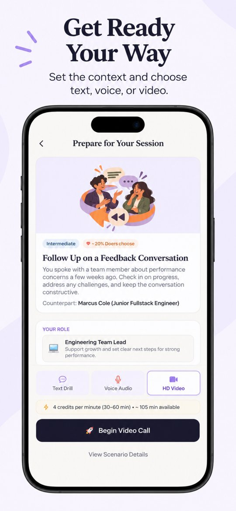
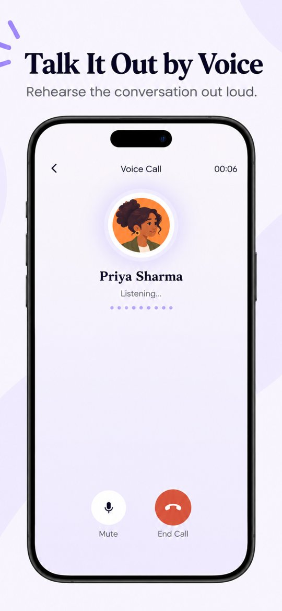
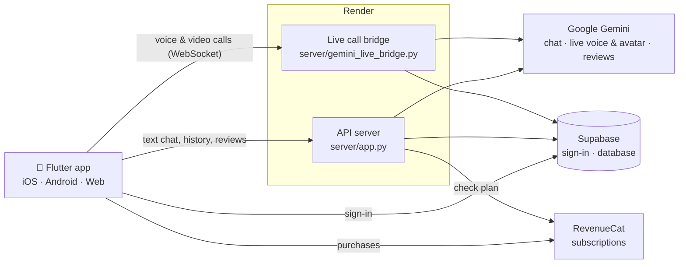

<div align="center">


# HardSync

**Practice the conversations that matter.**

[Website](https://vaishnavi-ch.github.io/hardsync/) · [FAQ](https://vaishnavi-ch.github.io/hardsync/faq.html) · [Privacy](https://vaishnavi-ch.github.io/hardsync/privacy.html) · [Terms](https://vaishnavi-ch.github.io/hardsync/terms.html)

</div>

---

Giving tough feedback, saying no to your boss, checking in on a teammate who's gone quiet. Most of us replay these in our heads and then wing it.

HardSync lets you practice them first. You pick a situation, talk it through with an AI colleague who reacts the way a real person might, and then read back what went well and what you could say differently.

<table>
<tr>
<td width="25%"></td>
<td width="25%"></td>
<td width="25%"></td>
<td width="25%"></td>
</tr>
<tr>
<td width="25%"></td>
<td width="25%"></td>
<td width="25%"></td>
<td width="25%"></td>
</tr>
</table>

## What you can do

**Practice your way.** Type it out, talk on a voice call, or have a face-to-face video call with a live avatar. Video calls are part of HardSync Ultra.

**Pick from real workplace situations.** Scenarios cover feedback, conflict, delegation, boundaries and one-to-ones. If none of them fit, describe your own situation and practice that instead.

**Talk to someone with a personality.** There are ten colleagues to practice with. Each has their own role, voice and temper, from a junior engineer who gets defensive to a VP who wants answers fast.

<p align="center"></p>

**Get honest feedback.** After each session you get a short review built from your own words:
- what you did well, and what to work on, across **clarity**, **acknowledgement** and **boundaries**
- the key moments, each with your exact quote and a phrase you could try next time
- one takeaway and a few next steps

There are no made-up scores. Every point links back to something you actually said.

**Look back.** Every session is saved with its full transcript, so you can see how you're improving.

## How it's built



- **Flutter app** (`lib/`): every screen, plus sign-in with Apple, Google or email.
- **API server** (`server/app.py`): handles text sessions, writes the post-session review with Gemini, stores history in Supabase and checks subscriptions with RevenueCat.
- **Live call bridge** (`server/gemini_live_bridge.py`): passes voice and video between the app and Gemini Live. Video calls use Gemini's live avatar.
- **Supabase** (`supabase/`): accounts, sessions, transcripts and reviews, all behind row-level security. Edge functions handle account deletion and Apple sign-in.

A few rules the code follows:
- AI keys stay on the server and never ship in the app.
- Calls are streamed live, not recorded. Only the transcript is saved.
- Each account can run one session at a time.

## Project layout

```
lib/          Flutter app (screens, services, models, theme)
server/       API server and live call bridge (Python)
supabase/     Database migrations and edge functions
web/          Flutter web shell and the live call page
assets/       Illustrations, avatars, icons
docs/         Website on GitHub Pages (FAQ, privacy, terms, account deletion)
site/public/  Copy of the website, deployed to Vercel
tools/        Dev launcher and helper scripts
test/         Flutter tests
```

## Running it locally

You'll need Flutter 3.35+, Python 3.13, and your own Supabase, Gemini and RevenueCat projects. Copy `.env.example` to `.env` and fill in the keys.

```powershell
flutter pub get
pip install -r server/requirements.txt -r server/requirements-gemini-live.txt

# starts the API, the live call bridge and the app together
python tools/run_dev.py
```

To run only the web app, use `.\scripts\run_web.ps1` and open http://localhost:8091.

<details>
<summary>Running the services one at a time</summary>

```powershell
python server/app.py --port 8082                                                # API
python -m uvicorn server.gemini_live_bridge:app --host 127.0.0.1 --port 8000   # live calls
python -m pytest server/test_app.py                                             # backend tests
flutter test                                                                    # app tests
```
</details>

## Deployment

| What | Where | Config |
|---|---|---|
| API server and live call bridge | Render | [render.yaml](render.yaml) |
| iOS builds to TestFlight | Codemagic | [codemagic.yaml](codemagic.yaml) |
| Website | GitHub Pages ([docs/](docs/)) and Vercel ([site/public/](site/public/)) | [vercel.json](vercel.json) |
| Database and auth | Supabase | [supabase/](supabase/) |

---

<p align="center"><sub>Made by <a href="https://github.com/vaishnavi-ch">@vaishnavi-ch</a> · Questions? vaishnavi26ch@gmail.com</sub></p>
