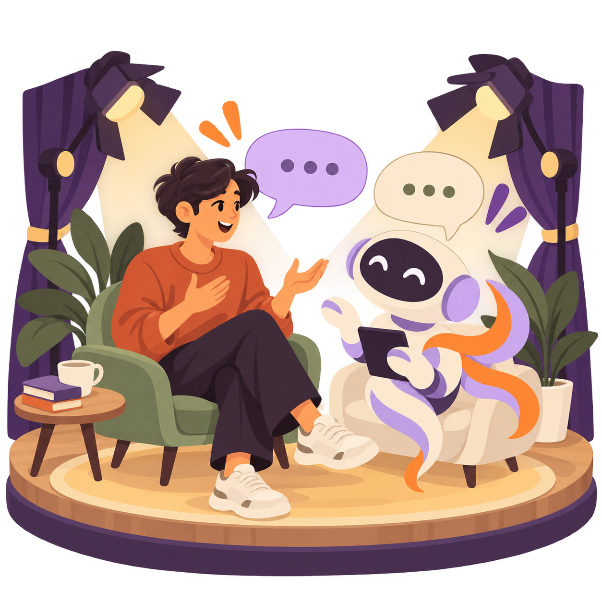
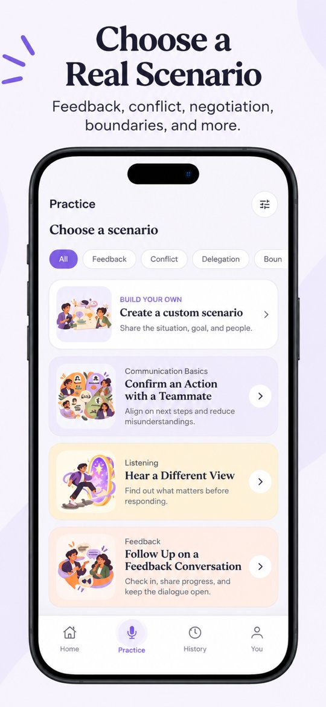
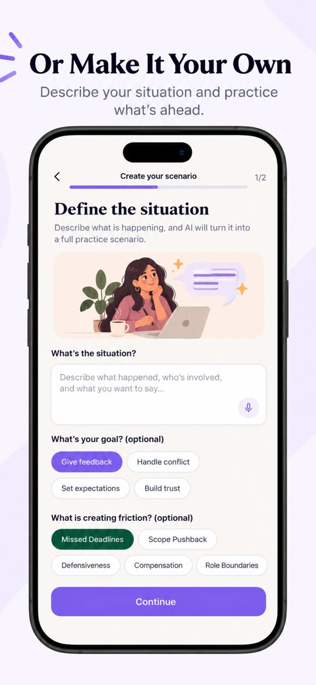
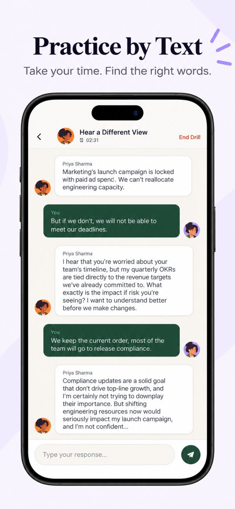
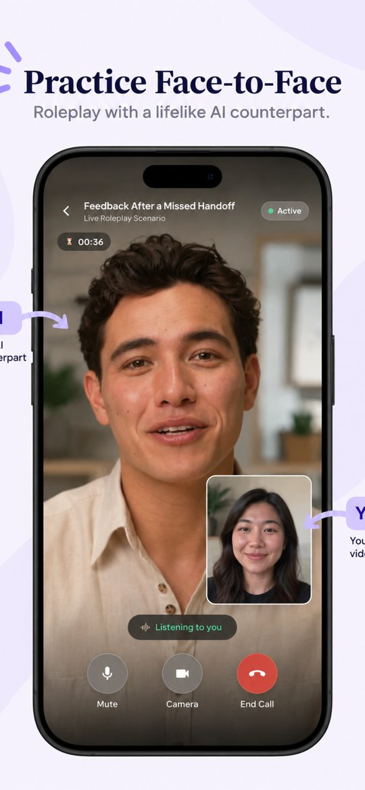
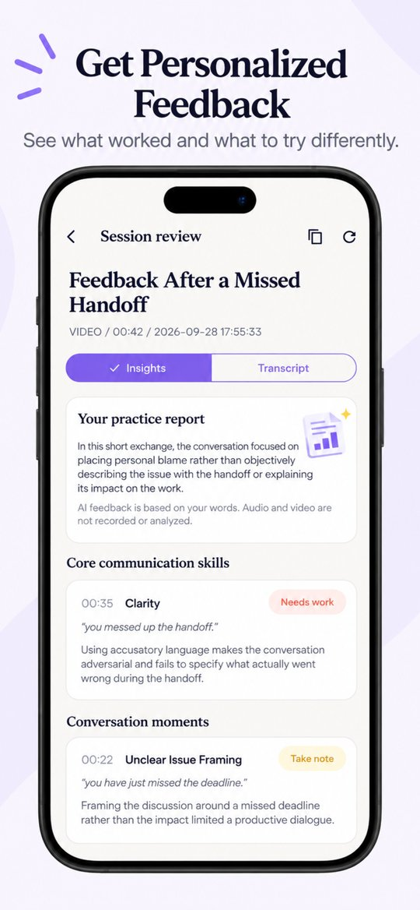
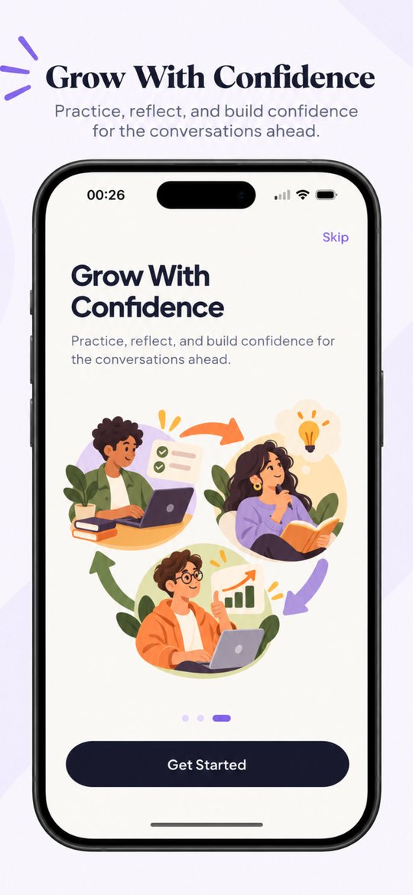
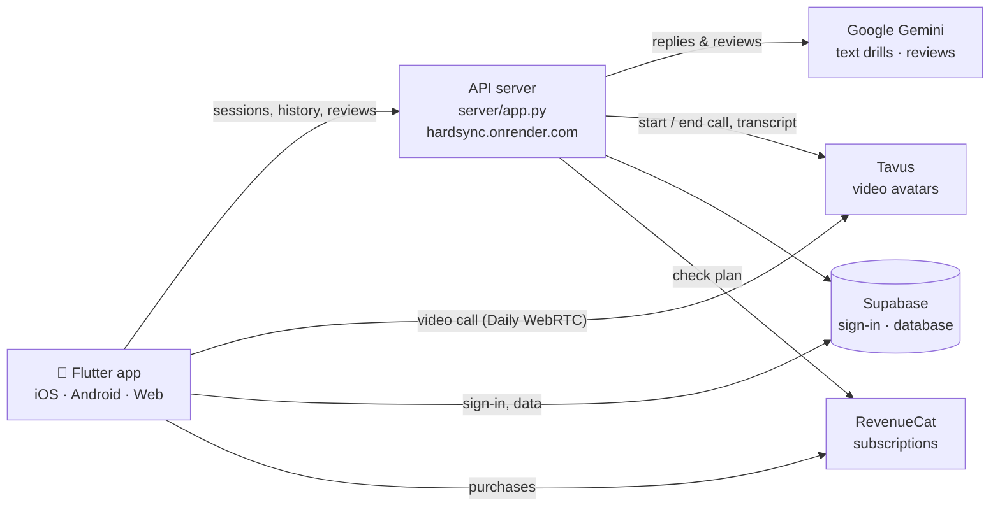

<div align="center">



# HardSync

**Practice the conversations that matter.**

[Website](https://vaishnavi-ch.github.io/hardsync/) · [FAQ](https://vaishnavi-ch.github.io/hardsync/faq.html) · [Privacy](https://vaishnavi-ch.github.io/hardsync/privacy.html) · [Terms](https://vaishnavi-ch.github.io/hardsync/terms.html)

</div>

---

Giving tough feedback, saying no to your boss, checking in on a teammate who's gone quiet. Most of us replay these in our heads and then wing it.

HardSync lets you practice them first. You pick a situation, talk it through with an AI colleague who reacts the way a real person might, and then read back what went well and what you could say differently.

<table>
<tr>
<td width="33%"></td>
<td width="33%"></td>
<td width="33%"></td>
</tr>
<tr>
<td width="33%"></td>
<td width="33%"></td>
<td width="33%"></td>
</tr>
</table>

## What you can do

**Practice two ways.** Type it out in a text drill (free), or have a face-to-face video call with a lifelike AI avatar (HardSync Ultra). Video calls run up to 10 minutes.

**Pick from real workplace situations.** More than 20 scenarios cover feedback, workload and boundaries, managing up, listening, conflict, delegation and leading change. If none of them fit, describe your own situation and practice that instead.

**Talk to someone with a personality.** There are ten colleagues to practice with. Each has their own role and temperament, from a junior engineer who gets defensive to a VP who wants answers fast. On video calls each one has their own face and voice.

<p align="center"></p>

**Get honest feedback.** After each session you get a short review built from your own words:
- what you did well, and what to work on, across **clarity**, **acknowledgement** and **boundaries**
- the key moments, each with your exact quote and a phrase you could try next time
- one takeaway and a few next steps

There are no made-up scores. Every point links back to something you actually said.

**Look back.** Every session is saved with its full transcript, so you can see how you're improving.

## How it's built



- **Flutter app** (`lib/`): every screen, plus sign-in with Apple, Google or email.
- **API server** (`server/app.py`), deployed on Render at `https://hardsync.onrender.com`. The app points there by default; override it with `--dart-define=BACKEND_URL=...`. It:
  - starts and ends sessions
  - writes the AI colleague's replies in text drills and the post-session review, both with Gemini
  - stores history in Supabase
  - checks subscriptions with RevenueCat
- **Video calls** use [Tavus](https://www.tavus.io/):
  - The API creates a Tavus conversation with the persona's avatar and the scenario context.
  - The app joins it inside a call page (`web/live_call.html`) over a Daily.co WebRTC room.
  - When the call ends, the API pulls the transcript from Tavus so it can be reviewed like a text drill.
- **Supabase** (`supabase/`): accounts, sessions, transcripts and reviews, all behind row-level security. Edge functions handle account deletion and Apple sign-in.

A few rules the code follows:
- API keys (Gemini, Tavus, RevenueCat) stay on the server and never ship in the app.
- Video calls aren't recorded. Only the transcript is saved.
- Each account can run one session at a time.

**Left over from earlier versions** (still in the repo or the config, but not used by the current app):
- `server/gemini_live_bridge.py`: the Gemini Live bridge for the old voice-call mode. Voice calls were removed, but `render.yaml` still deploys it as `hardsync-live` (`wss://hardsync-live.onrender.com`).
- **Cloudflare R2**: stored the old opt-in call replays. Replays and their table were removed (`supabase/migrations/20260928110000_drop_practice_replays.sql`), but the R2 keys are still in `.env.example`.
- LiveKit and LiveAvatar keys, from video-call experiments before Tavus.

## Project layout

```
lib/          Flutter app (screens, services, models, theme)
server/       API server (Python)
supabase/     Database migrations and edge functions
web/          Flutter web shell and the video call page
docs/         Website on GitHub Pages (FAQ, privacy, terms, account deletion)
site/public/  Copy of the website, deployed to Vercel
tools/        Dev launcher and helper scripts
test/         Flutter tests
```

## Running it locally

You'll need:
- Flutter 3.35+ and Python 3.13
- your own Supabase, Gemini, Tavus and RevenueCat accounts

Copy `.env.example` to `.env` and fill in the keys. It's grouped by service and notes which keys the current code doesn't read.

```powershell
flutter pub get
pip install -r server/requirements.txt -r server/requirements-gemini-live.txt

# starts the API, the old Live bridge and the app together
python tools/run_dev.py
```

To run only the web app, use `.\scripts\run_web.ps1` and open http://localhost:8091.

<details>
<summary>Running the services one at a time</summary>

```powershell
python server/app.py --port 8082          # API
python -m unittest server.test_app        # backend tests
flutter test                              # app tests
```
</details>

## Deployment

| What | Where | Config |
|---|---|---|
| API server | Render: [hardsync.onrender.com](https://hardsync.onrender.com) | [render.yaml](render.yaml) |
| Old Live bridge (unused) | Render: `hardsync-live.onrender.com` | [render.yaml](render.yaml) |
| iOS builds to TestFlight | Codemagic | [codemagic.yaml](codemagic.yaml) |
| Website | GitHub Pages ([docs/](docs/)) and Vercel ([site/public/](site/public/)) | [vercel.json](vercel.json) |
| Database and auth | Supabase | [supabase/](supabase/) |

---

<p align="center"><sub>Made by <a href="https://github.com/vaishnavi-ch">@vaishnavi-ch</a> · Questions? vaishnavi26ch@gmail.com</sub></p>
